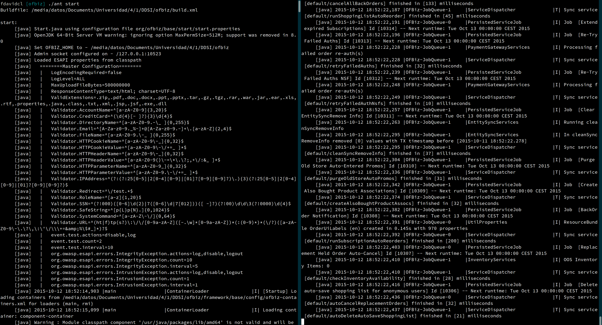
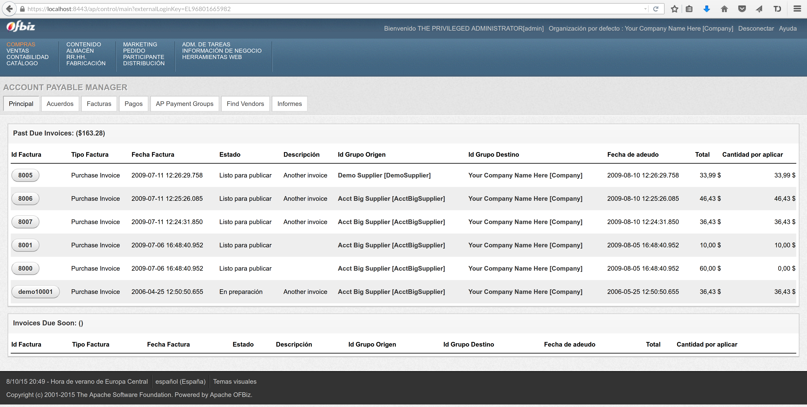
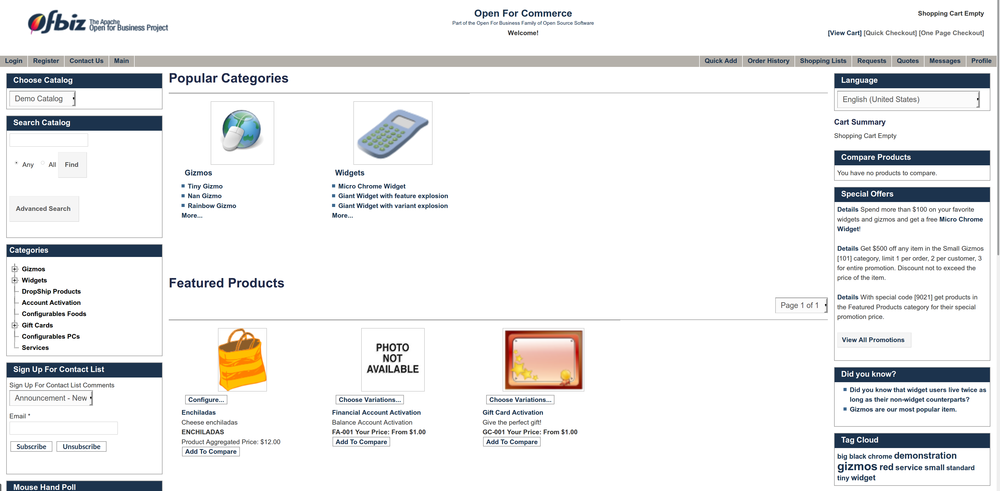

# 1. Introducción

## Visión general

Apache OFBiz es un conjunto de aplicaciones construidas en una arquitectura común dirigidas a la gestión de empresas. Su objetivo es ser muy flexible y extensible, al estar compuesto por módulos con poco acoplamiento, muy configurables. Además permite añadir nueva funcionalidad fácilmente y no requiere liberar el nuevo código gracias a la licencia Apache [1].

## Nota histórica

Los dos fundadores de OFBiz comenzaron en 2001 proyectos separados, tratando de resolver problemas similares [2]: las soluciones comerciales de ERP no proporcionaban suficiente funcionalidad y representaban un alto costo para los clientes. En julio de ese año, ambos proyectos convergieron en la solución denominada Open For Business (OFBiz), que más tarde se desarrollaría de forma comunitaria en Java.net. OFBiz comenzó a ser usado activamente en 2003, y en 2006, tras un período de incubación, la Apache Foundation acogió al projecto como un Top Level Project [3].

## Introducción

Las herramientas que nos ofrece OFBiz están pensadas para facilitar la automatización de muchos procesos empresariales, con un enfoque en el comercio online. Los componentes son fácilmente mantenibles y ampliables, permitiendo a los desarrolladores publicar nuevas funcionalidades en cortos periodos de tiempo, y a las empresas adaptar el sistema a sus necesidades, pudiendo modificar ciertos aspectos del programa para que se adapte mejor a su modelo interno. Esto es posible gracias a la arquitectura de OFBiz, pero sobre todo se debe a que OFBiz es un software de código abierto, es en otro caso no seria modificable. Podemos modificar OFBiz sin restricciones, pues Apache cree que en otro caso el programa no podria usarse adecuadamente. Al contrario que software similar bajo licencia GPL, los cambios en OFBiz no tienen que ser publicados en codigo abierto. Si bien puede perderse un beneficio para la comunidad, es sensato desde el punto de vista de la empresa, pues algunos cambios pueden incluir información confidencial que no debe ser expuesta fuera de la empresa. Por esta razon, OFBiz usa "Apache License Version 2.0" [4], que permite lo comentado anteriormente.

Un claro beneficio de tener un programa de codigo abierto es que se recibe "feedback" de sus usuarios, ya sea con reportes de errores, sugerencias de mejoras y un asesoramiento desde el punto de vista empresarial por parte de clientes o posibles clientes.

Referencias:

1. https://ofbiz.apache.org/apache-ofbiz-project-overview.html
1. https://today.java.net/pub/a/today/2004/06/01/ofbiz.html
1. https://incubator.apache.org/projects/ofbiz.html
1. https://www.apache.org/licenses/LICENSE-2.0

# Punto 2 - Descripción de la instalación.

OFBiz se puede descargar en un archivo preparado para la ejecución desde el sitio oficial. Basta con descomprimir el archivador *zip* en una carpeta y ejecutar `./ant start` para arrancar la aplicación (figura \ref{inicio}). Además, se proporciona el comando `load-demo` de la utilidad `ant` para cargar datos de ejemplo que poblen la aplicación de manera que se pueda comprobar su funcionalidad.

Puesto que OFBiz está escrito en Java, será necesario haber instalado el JDK en una versión reciente.

OFBiz incluye una base de datos empotrada (Apache Derby) que puede servir para las pruebas en desarrollo, pero no es adecuada para utilizarla en un entorno de producción. Se recomiendan bases de datos más preparadas como PostgreSQL o MySQL. La configuración de la base de datos en OFBiz se realiza en el archivo `entityengine.xml`.

Otros archivos XML permiten realizar la configuración de diversos parámetros, entre ellos, los ajustes de caché y depuración, seguridad, servidor (URL, puerto, servidor de correo), certificados TLS. Asimismo, la utilidad `ant` también lanza paralelamente a la aplicación de gestión un servidor web con la página de comercio online que se puede personalizar posteriormente.

Tras la configuración de la aplicación se puede iniciar en otro momento con `./ant start`, que es recomendable almacenar como un servicio del sistema operativo.

# Punto 3 - Funcionalidad que ofrece.

Compraventa: Gestión de facturas, pagos y acuerdos, entre otros. Al estar integrado con Orbital, CyberSource, Authorize.net, PayPal y PayflowPro OFBiz ofrece la posibilidad de procesar transacciones mediante tarjetas de crédito y PayPal de forma completamente segura.

Contabilidad: Gestión de activos, transacciones, cuentas bancarias, autoridades fiscales, y todo lo relacionado con las cuentas internas de la empresa y su situación fiscal.

Catálogo: Nos permite controlar los productos que ofrece la empresa, incluidos en catálogos que también podemos gestionar e incluso organizar jerárquicamente. Podremos gestionar el inventario, ofertas y promociones, todo ello con distinción entre diferentes tiendas, además de manejar envíos y suscripciones.

Contenido: Gestor de contenidos web, principalmente la tienda online, pero incluye otros tales como foros, encuestas, blogs, etc... abriendo la posibilidad de tener otros sitios web que puedan servir como lugares de discusión sobre los productos ofrecidos por la empresa.

Almacén: Podremos gestionar el stock, controlar los envíos y detalles de inventario, todo esto diferenciando los almacenes en caso de haber más de uno. También permite especificar las direcciones físicas de la empresa.

Recursos humanos: Puedes poner el nombre de tu compañía (10/10 best ERP ever - FSF). Gestión de departamentos, equipos de trabajo, empleados (cualificaciones, formación de los mismos, historial de pagos), contrataciones, resúmenes, revisión de rendimiento y gestión de bajas.

Gestión de producción: Permite gestionar de materiales necesarios para la producción de artículos.

Marketing: Campañas de marketing, recogida de datos para análisis, segmentación de mercado y seguimiento de campañas online (anuncios en otros sitios web).

Pedido: Podemos ver aquellos productos que mejor se han vendido, manejar los pedidos hechos desde la página expuesta al público, gestionar presupuestos, devoluciones y visualizar estadísticas.

Participantes: Gestión de los usuarios de la aplicación con seguimiento y de los roles que se le pueden asignar, configuración de seguridad (permisos de cada usuario) e invitaciones.

Automatización de fuerza de ventas: Archiva las etapas en un proceso de ventas, realizando el seguimiento de una venta en todas sus etapas, para obtener información y no repetir pasos ya dados.

Administración de tareas: Contiene un gestor de tareas integrado con calendario (y posibilidad de sincronizarlo con el del ordenador), repartición del tiempo y esfuerzo de trabajo.

Inteligencia de negocios: Recoge datos y genera informes a partir del análisis de estos datos, con técnicas de Data Warehousing y Data Mining.

Herramientas web: Gestión interna de la aplicación (OFBiz), pudiendo exportar e importar datos en formatos estándares, gestión de los archivos de registro y la caché, administración, seguridad, configuración, etc...

# Punto 4 - Ventajas e inconvenientes encontrados durante la prueba.

Ventajas.

Amplia funcionalidad, adaptable a las necesidades concretas de cada usuario.

La licencia Apache nos permite realizar cambios sin tener que publicarlos.

Tenemos la posibilidad de usar distintos SGBD, como MySQL, PostgreSQL o Apache Derby, sin tener que restringirnos a uno en particular.

El framework incluye herramientas de automatización de testing, manejo de base de datos, cache, job scheduler, etc.

Está escrito en Java, lo que permite una sencilla portabilidad entre distintos sistemas.

Inconvenientes.

El catálogo es demasiado lioso a la hora de gestionarlo, debido a la amplia jerarquía.

La versión de prueba no está completamente traducida al castellano.

La curva de aprendizaje es muy larga. Hay demasiados módulos, procesos, lenguajes... (muchas cosas programables mediante código). Mientras que encontrar documentación que facilite el aprendizaje es complicado.

# Punto 5 - Empresas que utilizan OFBiz.

Referencias:

1. https://cwiki.apache.org/confluence/display/OFBIZ/Apache+OFBiz+User+List

Borngifted: Empresa dedicada al sector de los regalos para niños, especializada en regalos para bautizos. Comenzaron a usar OFBiz en 2004, lo que les ha permitido reducir costes de administración y ofrecer un servicio mucho más amplio al cliente.

British Telecom: Empresa de telecomunicaciones con sede en Londres, extendida en más de 170 países, que ofrece servicios de telefonía, banda ancha y televisión de pago entre otros. Es una de las empresas del sector más importantes a nivel mundial.

Just Jewelry: Empresa estadounidense dedicada a la venta de joyas online.

1-800-Flowers: Empresa estadounidense dedicada a la venta de flores online.

American Heart Association: Es una asociación sin ánimo de lucro dedicada a promover un mejor nivel de vida mediante la concienciación del ejercicio físico y una dieta responsable, financiando eventos, formando voluntarios y contribuyendo a la investigación. Ofrece productos tales como recetas de cocina saludables, dirigidas a todos los públicos o a aquellos con ciertas enfermedades como la diebetes, y también comercializa merchandising que permite a cualquier persona colaborar con la asociación.

I Want One Of Those: Empresa británica especializada en regalos. Después de probar varios ERP de pago y de tener serios problemas con ellos -tanto de fallos del software (Priam) como de precios excesivos (Elucid)-, decidieron invertir fuertemente en su departamento de IT y diseñar un ERP que se adaptase a sus necesidades usando OFBiz. Referencia: http://www.information-age.com/technology/applications-and-development/825137/iwoots-open-source-odyssey

United Airlines: Aerolínea estadounidense operativa en más de 170 países.

Steiner Sports: Tienda estadounidense especializada en el merchandising y material deportivo de alta gama, incluyendo artículos exclusivos de deportistas de élite.

Action Envelope: Es una empresa estadounidense encargada de la venta de sobres, tarjetas de bodas y similares.
