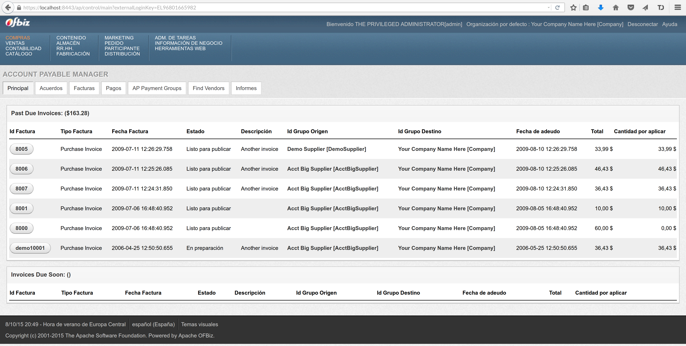

# Introducción
## Nota histórica

* 2001: comienza como 2 proyectos separados
* Julio 2001: convergen en Open For Business (OFBiz)
* 2003: OFBiz empieza a ser usado activamente
* 2006: la Apache Foundation acoge OFBiz como Top Level Project

## Introducción

* Automatización de la gestión de empresas
* Enfocado al comercio online
* Mantenible, flexible y extensible
* Software de código abierto con Apache License Version 2.0
* Reportes de errores, sugerencias de mejoras y "feedback" de sus usuarios

# Uso y funcionalidad

## Instalación

* Utilidad `ant`: lanza y detiene la aplicación y el sitio web
* Configuración en archivos XML
* Base de datos integrada: Apache Derby

\begin{figure}[h]
\centering
\includegraphics[width=0.6\textwidth]{instalacion.png}
\end{figure}

## Funcionalidad

* Gestión de compraventa y contabilidad
* Control sobre los pedidos, el catálogo, los almacenes y la producción
* Gestíon de recursos humanos, con información sobre los empleados
* Administración de tareas
* Marketing e inteligencia de negocios 
* Archiva las etapas del proceso de ventas 
* Posibilidad de crear otros sitios web, como foros o blogs
* Gestión interna de la aplicación

-----------

# Ventajas e incovenientes

## Ventajas

* Amplia funcionalidad
* Licencia Apache
* Varios posibles SGBD
* Herramientas de automatización
* Escrito en Java (portable)

## Incovenientes

* Curva de aprendizaje muy larga
* Catálogo lioso (jerarquía)
* Traducción al castellano incompleta
* Documentación poco amigable para novatos

# Clientes

## Empresas que utilizan OFBiz
* British Telecom
* American Heart Association
* United Airlines
* Borngifted, Just Jewelry, 1-800-Flowers, I Want One Of Those, Steiner Sports, Action Envelope...
